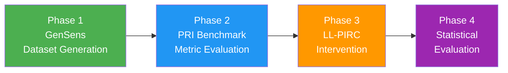
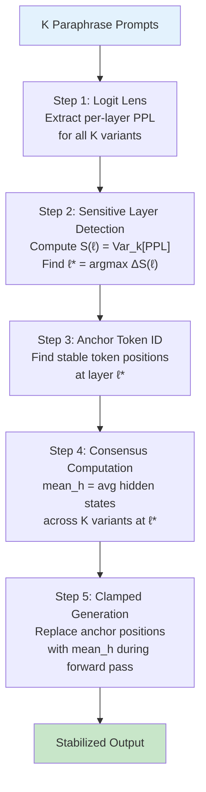
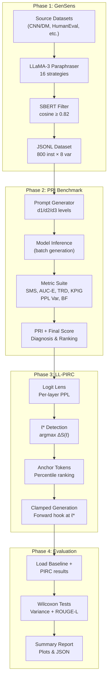

# Complete Evaluation Methodology

This document provides an end-to-end explanation of every component and algorithm used in the **Prompt Sensitivity** evaluation framework. The system is structured as a **4-phase pipeline** that measures how sensitive LLMs are to semantically equivalent prompt rephrasings, and then *intervenes* at the model's internal representations to eliminate that sensitivity.

---

## High-Level Architecture



| Phase | Purpose | Key Output |
|-------|---------|------------|
| **1. GenSens** | Generate semantically equivalent prompt paraphrases | JSONL dataset of 800 instances × 8 variants |
| **2. PRI Benchmark** | Quantify robustness via 6 core + 4 advanced metrics | Per-model PRI scores, rankings, diagnoses |
| **3. LL-PIRC** | Intervene at the model's hidden states to *fix* sensitivity | Stabilized model outputs |
| **4. Evaluation** | Statistically validate that PIRC improves consistency | Wilcoxon tests, variance reduction % |

---

## Phase 1: GenSens — Dataset Generation

> **Goal:** Create a high-quality benchmark dataset of semantically equivalent prompt paraphrases to test LLM sensitivity.

### 1.1 Source Datasets

The benchmark draws from 4 diverse NLP task domains:

| Task | Source Dataset | Instances |
|------|---------------|-----------|
| Summarization | CNN/DailyMail | 200 |
| Code Generation | HumanEval + MBPP | 200 |
| Creative Writing | WritingPrompts | 200 |
| Dialogue | MultiWOZ 2.2 | 200 |

### 1.2 Paraphrase Generation

For each of the 800 base instances, **8 paraphrase variants** are generated using **LLaMA-3-8B-Instruct** (bfloat16). The system employs **16 diverse paraphrase strategies** including:

- Formal tone shifts
- Casual rewording
- Synonym substitution
- Clause reordering
- Passive ↔ active voice
- And more...

### 1.3 SBERT Semantic Filtering

> [!IMPORTANT]
> Not all paraphrases are accepted — a strict semantic similarity gate ensures that only *truly equivalent* rephrasings make it into the dataset.

**Algorithm:**
1. Encode both the base prompt and each generated variant using **SBERT** (`all-mpnet-base-v2`)
2. Compute **cosine similarity** between the two embeddings
3. **Accept** the variant only if `cosine_similarity ≥ 0.82`
4. If a variant fails, retry with a different strategy (up to a budget)

This filtering prevents the dataset from containing prompts that *look* like paraphrases but actually change the task semantics.

### 1.4 Validation Checks

After generation, a strict validation pass ensures:

- **Completeness:** Every instance has exactly 8 variants
- **No exact copies:** Every variant is functionally rewritten (not duplicated)
- **Length bounds:** All variants fall within acceptable word-count ranges
- **No degenerate substitutions:** Ensures meaningful lexical variation

**Output:** JSONL files like `gensens_summarization_200inst_8var.jsonl`, each containing structured records with base text, variants, similarity scores, and metadata.

---

## Phase 2: PRI Benchmark — Prompt Robustness Evaluation

> **Goal:** Quantify how robust a model's outputs are when the same question is asked in different ways.

### 2.1 Prompt Variant Generation (At Evaluation Time)

The evaluator generates 3 tiers of prompt perturbation using the **ORI framework**:

| Level | Name | Perturbation | Example Template |
|-------|------|-------------|-----------------|
| **d1** | Literal | Low | "Summarize the following text: {}" |
| **d2** | Stylistic | Medium | "Condense the text into a short summary: {}" |
| **d3** | Creative | High | "Produce a neutral summary of the passage in 2-3 sentences: {}" |

Each level has 3 templates (9 total prompts per sample). The model generates a response for every prompt variant.

### 2.2 Core ORI Metrics (6 Metrics)

These are the **Observable Robustness Index** sub-metrics, computed from the set of model responses:

---

#### 2.2.1 SMS — Semantic Manifold Stability

**What it measures:** Are all responses semantically similar to each other?

**Formula:**
```
SMS = mean(cosine_similarity(e_i, e_j)) − α · Var(embeddings)
```

- Embeddings `e_i` come from **Sentence-BERT** (`all-MiniLM-L6-v2`)
- The **diversity penalty** (α = 0.5) penalizes high variance in the embedding space
- **High SMS** = model produces consistently similar outputs regardless of phrasing

---

#### 2.2.2 AUC-E — Performance Elasticity

**What it measures:** How gracefully does performance degrade under progressively imperfect references?

**Algorithm:**
1. Truncate the reference output at levels: 10%, 20%, 30%
2. Measure how much the model's response deviates from each truncated reference
3. Compute **Area Under the Curve (AUC)** via the trapezoidal rule

**High AUC-E** = model remains close to the reference even under noisy evaluation conditions.

---

#### 2.2.3 TRD — Thematic Robustness Drift

**What it measures:** Do outputs vary wildly in length/verbosity across prompts?

**Formula:**
```
TRD = Var(response_lengths) / mean(response_lengths)²
```

**Low TRD** = consistent output structure; **High TRD** = the model's style drifts significantly.

---

#### 2.2.4 KPIG — Key Point Information Gain

**What it measures:** Does each response preserve the key information found across all runs?

**Algorithm:**
1. Extract "facts" from all responses (words > 4 characters)
2. Compute the union of all unique facts across K responses
3. For each individual response, measure `|facts_in_response ∩ all_facts| / |all_facts|`
4. Average across responses

**High KPIG** = each response captures the same key facts.

---

#### 2.2.5 PPL Variance — Perplexity Variance

**What it measures:** Does the model's confidence (perplexity) fluctuate across prompt variants?

Computed by passing each response back through the model and measuring the variance in perplexity scores.

---

#### 2.2.6 BF — Branching Factor

**What it measures:** How uncertain is the model at the token level during generation?

Computes average token-level entropy during generation and converts it to a branching factor (`2^entropy`). High branching = many plausible next tokens = high uncertainty.

---

### 2.3 Advanced Metrics (4 Metrics)

These are more sophisticated versions of the core metrics:

| Metric | Enhancement |
|--------|------------|
| **TRD Semantic** | Uses embedding cosine distances instead of raw word counts to detect *semantic* drift |
| **SMS Wasserstein** | Approximates Earth-Mover's Distance between response embedding distributions |
| **KPIG Advanced** | Semantic information gain with redundancy penalty using embeddings |
| **USD (Utility-Stability Divergence)** | Measures disagreement between PRI (stability) and Human Score (quality): `USD = |PRI − Human_Score|` |

### 2.4 Quality & Fidelity Metrics

#### Correctness Score (CS)
```
CS = cosine_sim(response_embedding, reference_embedding) × keyword_coverage
```
- Combines semantic similarity with named entity overlap
- Penalized if entity coverage < 20%
- Further penalized by KPIG: `CS = CS × (0.5 + 0.5 × KPIG)`
- Hallucination-corrected: `CS = CS × exp(−1.5 × HS)`

#### Hallucination Score (HS)
```
HS = |hallucinated_facts| / |total_facts_in_response|
```
Where "hallucinated facts" are response facts **not present** in the input text.

#### IFI — Intrinsic Fidelity Index
```
IFI = 1 − (PPL_variance + Branching_Factor) / 2
```
Measures the model's internal confidence/certainty. **High IFI** = the model is internally stable.

#### ORI — Observable Robustness Index
```
ORI = (SMS + AUC-E + (1 − TRD) + KPIG) / 4
```
Aggregates the four core output-level robustness metrics.

### 2.5 LLM-as-a-Judge (Human Score Approximation)

A **Flan-T5-base** model acts as a zero-shot evaluator, scoring the best summary on a 1–5 scale. The raw score is normalized to [0, 1]:

```
Human_Score = parse_judge_output(flan_t5(input, response)) / 5.0
```

### 2.6 PRI Computation

The **Prompt Robustness Index** is computed as a weighted combination:

```
PRI = 0.40 × Consistency + 0.35 × Correctness + 0.25 × exp(−HS)
```

Where `Consistency = SMS` (Semantic Manifold Stability).

**Penalties applied:**
- If `HS > 0.5`: `PRI *= 0.6` (severe hallucination penalty)
- If `avg_length < 12`: `PRI *= 0.85` (too-short output penalty)

### 2.7 Final Score

```
Final_Score = 0.6 × PRI + 0.4 × Human_Score
```

With **optional dynamic weighting** when USD is high (PRI and human disagree):
```
trust_human = min(0.7, base_human_weight + 0.3 × USD)
Final_Score = (1 − trust_human) × PRI + trust_human × Human_Score
```

### 2.8 Attribution / Diagnosis

Each model is classified into one of four categories:

| Category | Condition | Meaning |
|----------|-----------|---------|
| **True Robustness** | High scores across all metrics | Genuinely robust model |
| **Stochastic Luck** | High PRI but inconsistent underlying metrics | Appears robust by chance |
| **Evaluation Artifact** | Very low score in any single metric | Result is an artifact of the eval setup |
| **Knowledge Boundary** | Moderate results overall | Model is at its competence boundary |

### 2.9 The PRI Formula (Harmonic Mean Variant)

For the formal mathematical formulation, PRI uses a **weighted harmonic mean**:

```
PRI_formal = Σw_i / Σ(w_i / S_i)
```

This is critical because the harmonic mean **heavily penalizes any single low metric**, unlike the arithmetic mean which can mask weaknesses.

---

## Phase 3: LL-PIRC — Intervention Pipeline

> **Goal:** Given that models *are* sensitive to prompt phrasing, can we *fix* this at inference time by intervening in the model's internal representations?

**LL-PIRC** = **Logit-Lens Paraphrase-Invariant Residual Clamping**



### 3.1 Step 1 — Logit Lens Extraction

The **Logit Lens** technique (Belrose et al., ICML 2023) projects intermediate hidden states through the final unembedding head to see what each layer "thinks" the output should be:

```
logits^(ℓ) = lm_head(LayerNorm(h^(ℓ)))
```

From these logits, **per-token perplexity** at each layer is computed:

```
PPL(t_i, ℓ) = exp(−log_softmax(logits^(ℓ))[t_{i+1}])
```

This is done for **every layer** of the model, for **every paraphrase variant**.

### 3.2 Step 2 — Sensitive Layer Detection (ℓ*)

**Goal:** Find the layer where the model first "notices" that prompts are phrased differently.

**Sensitivity Signal:**
```
S(ℓ) = Var_k[mean per-token PPL at layer ℓ]
```

Where the variance is computed across the K paraphrase variants. High `S(ℓ)` means: "At layer ℓ, the model produces very different perplexity patterns depending on which paraphrase it received."

**Detection Methods:**

1. **Inflection method (default):** `ℓ* = argmax_ℓ [S(ℓ) − S(ℓ−1)]` — the layer with the sharpest upward jump in sensitivity
2. **Z-score fallback:** First layer where `S(ℓ) > mean(S) + z × std(S)` (default z=2.0)

The scan range skips the first 25% of layers (which are typically uninformative) and covers up to 100%.

### 3.3 Step 3 — Anchor Token Identification

**Goal:** At layer ℓ*, find which token positions are "anchors" — positions where the model is **confident AND consistent** across all K variants.

**Percentile-Based Algorithm (default):**

1. For each token position `i`, compute:
   - `mean_ppl[i]` = mean PPL across K variants
   - `var_ppl[i]` = variance of PPL across K variants
2. Rank all positions by **stability score**:
   ```
   stability[i] = rank(mean_ppl[i]) + rank(var_ppl[i])
   ```
   Lower = more stable = better anchor candidate
3. Select the bottom **P% most-stable** positions (default P = 30%)
4. Filter out punctuation and stopword tokens (with fallback if all are removed)
5. **Guarantee:** At least 1 anchor, at most ⌊min_len/2⌋ anchors

> [!NOTE]
> A legacy absolute-threshold method (`mean_ppl < τ AND var_ppl < τ_var`) exists but is deprecated because different model architectures have wildly different PPL scales, causing it to silently produce zero anchors.

### 3.4 Step 4 — Consensus Hidden State

Collect the hidden states at layer ℓ* for all K paraphrases and compute the **mean (consensus) representation**:

```python
all_hidden = stack([h_ℓ*(prompt_k) for k in range(K)])  # (K, seq_len, d_model)
mean_h = all_hidden.mean(dim=0)                          # (seq_len, d_model)
```

Variable sequence lengths are handled by truncating to the minimum length.

### 3.5 Step 5 — Clamped Generation

A **PyTorch forward hook** is registered at layer ℓ*. During `model.generate()`, the hook intercepts the hidden states and replaces anchor token positions with the consensus:

**Full clamping (α = 1.0):**
```
h_clamped[anchor_positions] = mean_h[anchor_positions]
```

**Soft clamping (α < 1.0):**
```
h_clamped = α × mean_h + (1 − α) × h_original
```

Generation uses **greedy decoding** (`do_sample=False`) for full reproducibility.

> [!TIP]
> The key insight: by replacing the hidden states at positions where the model is confident and consistent, we force the model to produce the same internal representation regardless of the surface-level prompt phrasing. This eliminates "prompt sensitivity" at its root.

---

## Phase 4: Statistical Evaluation

> **Goal:** Rigorously validate that PIRC actually improves output consistency without sacrificing quality.

### 4.1 Metrics Compared

| Metric | Baseline | PIRC |
|--------|----------|------|
| **ROUGE-L variance** | Computed across K prompt variants | **Zero** (PIRC produces a single deterministic output) |
| **Mean ROUGE-L** | Average quality across K variants | Quality of the single PIRC output |

### 4.2 Relative Variance Reduction

```
Δ_var = 1 − mean(var_pirc) / mean(var_baseline)
```

Since PIRC produces exactly one deterministic output per article, `var_pirc = 0`, so `Δ_var = 100%` by construction. The more meaningful comparison is whether quality is preserved.

### 4.3 Statistical Tests

#### Wilcoxon Signed-Rank Test (Variance)
- **Non-parametric** paired test on per-article ROUGE-L variances
- **One-sided:** tests if `var_baseline > var_pirc` (i.e., PIRC reduces variance)
- **Significance level:** α = 0.01

#### Wilcoxon Signed-Rank Test (ROUGE-L Quality)
- **Two-sided:** tests if PIRC significantly *changes* ROUGE-L quality
- Ensures quality is **preserved** (change should not be statistically significant, or if significant, should be positive)

### 4.4 ℓ* Distribution Analysis

Statistics on the identified sensitive layer across all articles:
- Mean, std, min, max, coefficient of variation
- Validates the theory that ℓ* should cluster around the 60–70% depth mark of the network

### 4.5 Visualization Outputs

1. **S(ℓ) Sensitivity Curves:** Per-article plots showing how sensitivity varies across layers, with ℓ* marked
2. **Variance Comparison:** Scatter plot (baseline vs. PIRC variance) + histogram of variance reduction

---

## End-to-End Data Flow Summary



---

## Key Mathematical Formulas — Quick Reference

| Symbol | Formula | Meaning |
|--------|---------|---------|
| **SMS** | `mean(cos_sim) − α · Var(emb)` | Semantic consistency across responses |
| **TRD** | `Var(lengths) / mean(lengths)²` | Output structural drift |
| **KPIG** | `mean(|facts_i ∩ all_facts| / |all_facts|)` | Information preservation |
| **S(ℓ)** | `Var_k[mean_token_PPL at layer ℓ]` | Per-layer sensitivity signal |
| **ℓ\*** | `argmax_ℓ [S(ℓ) − S(ℓ−1)]` | Sensitive layer (inflection) |
| **PRI** | `0.40·Consistency + 0.35·CS + 0.25·exp(−HS)` | Prompt Robustness Index |
| **Final** | `0.6·PRI + 0.4·Human_Score` | Composite evaluation score |
| **Δ_var** | `1 − mean(var_pirc) / mean(var_baseline)` | Variance reduction from PIRC |

---

## Key Source Files

| Component | File |
|-----------|------|
| Dataset Generation | [generate_dataset.py](file:///Users/saiabhinav/Desktop/PROMPT%20%20SENSITIVITY/gensens/scripts/generate_dataset.py) |
| Dataset Validation | [validate_dataset.py](file:///Users/saiabhinav/Desktop/PROMPT%20%20SENSITIVITY/gensens/scripts/validate_dataset.py) |
| PRI Benchmark Entry | [main.py](file:///Users/saiabhinav/Desktop/PROMPT%20%20SENSITIVITY/prompt_robustness/main.py) |
| Core Evaluator | [evaluator.py](file:///Users/saiabhinav/Desktop/PROMPT%20%20SENSITIVITY/prompt_robustness/src/evaluator.py) |
| PRI Calculator | [pri_calculator.py](file:///Users/saiabhinav/Desktop/PROMPT%20%20SENSITIVITY/prompt_robustness/src/pri_calculator.py) |
| Prompt Generator | [prompt_generator.py](file:///Users/saiabhinav/Desktop/PROMPT%20%20SENSITIVITY/prompt_robustness/src/prompt_generator.py) |
| Logit Lens | [logit_lens.py](file:///Users/saiabhinav/Desktop/PROMPT%20%20SENSITIVITY/prompt_robustness/src/logit_lens.py) |
| Sensitive Layer | [sensitive_layer.py](file:///Users/saiabhinav/Desktop/PROMPT%20%20SENSITIVITY/prompt_robustness/src/sensitive_layer.py) |
| Anchor Tokens | [anchor_tokens.py](file:///Users/saiabhinav/Desktop/PROMPT%20%20SENSITIVITY/prompt_robustness/src/anchor_tokens.py) |
| PIRC Generator | [pirc.py](file:///Users/saiabhinav/Desktop/PROMPT%20%20SENSITIVITY/prompt_robustness/src/pirc.py) |
| Statistical Evaluation | [evaluate.py](file:///Users/saiabhinav/Desktop/PROMPT%20%20SENSITIVITY/prompt_robustness/evaluate.py) |
| Methods Documentation | [METHODS_DOCUMENTATION.md](file:///Users/saiabhinav/Desktop/PROMPT%20%20SENSITIVITY/prompt_robustness/METHODS_DOCUMENTATION.md) |
